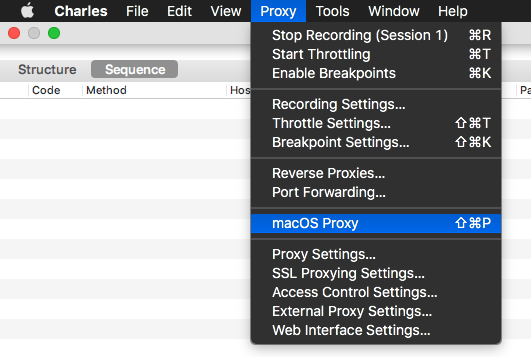
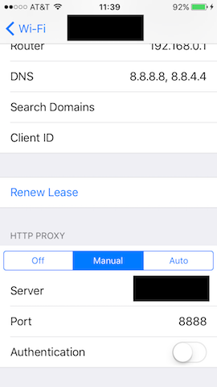
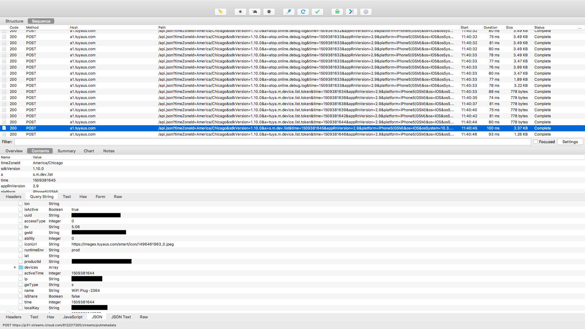

Setup
=========

## macOS

1. Download [Charles](https://www.charlesproxy.com).
2. Turn off the local proxy for your computer:



3. And turn off recording for now (with the red button), so it's easier to find the correct data later on:


4. Setup Charles' [SSL certificate](https://www.charlesproxy.com/documentation/using-charles/ssl-certificates/) for your phone.
5. Proxy your phone's traffic through Charles (IP is the IP of your computer):



6. Launch the app that came with your device. If you've already added the device you want to configure to the app, remove it now.
7. Add your device. Before tapping "Continue" after entering your network's password, pause and turn back on traffic recording in Charles.


8. When the device is added in the app, turn off traffic recording in Charles.
9. Find the HTTPS request where `a=s.m.dev.list`:



10. Find the parameters needed for constructing a TuyAPI instance from the contents of the response:
```
{
  id: uuid,
  uid: productId,
  key: localKey
}
```


## Android


### Capture https traffic

Only requires an Android device. Root not required, this captures the stream from the Android application to the Jinvoo/Tuya web servers. It does NOT capture between Android device and remote control device.

1) Remove registration for existing device if present

2) Install "Packet Capture" https://play.google.com/store/apps/details?id=app.greyshirts.sslcapture (follow instructions, install cert, then start capturing, its possibly to use the green triangle/play button with a "1" on it to only capture from the Jinvoo app).

3) Run Jinvoo Smart App to (re-)add device.

4) Hit stop button back in "Packet Capture" app.

5) review captured packets (first or last large one, 9Kb of 16Kb) use macOS step 11 for guide.

### Extract details from android config file

From https://github.com/codetheweb/tuyapi/issues/5#issuecomment-352932467

If you have a rooted Android phone, you can retrieve the settings from the app (Smart Life) data storage. The keys/configured devices are located at /data/data/com.tuya.smartlife/shared_prefs/dev_data_storage.xml

There's a string in there (the only data) called "tuya_data". You need to html entity decode the string and it contains a JSON string (yes, this is slightly ridiculous). Inside the JSON string are the keys.

